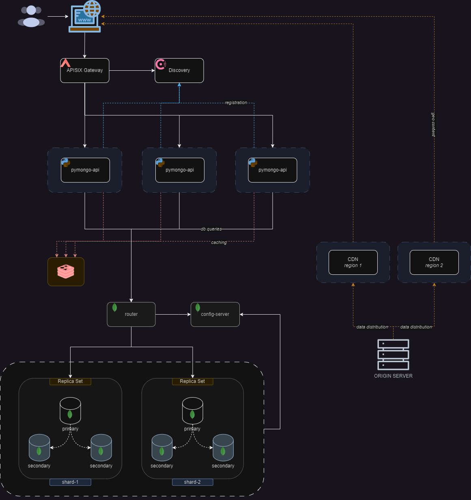

# Проектная работа 2

## API Gateway - Discovery



## Запуск

```bash
cd sharding-repl-cache-gateway
docker compose up -d

sleep 60

./scripts/mongo-init.sh
```
> Consul discovery @ `http://127.0.0.1:8500`

> API calls via `http://127.0.0.1:9080`
