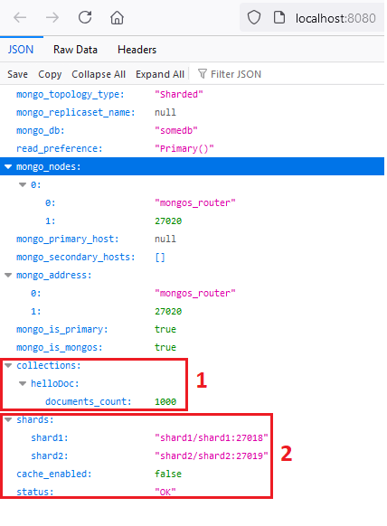
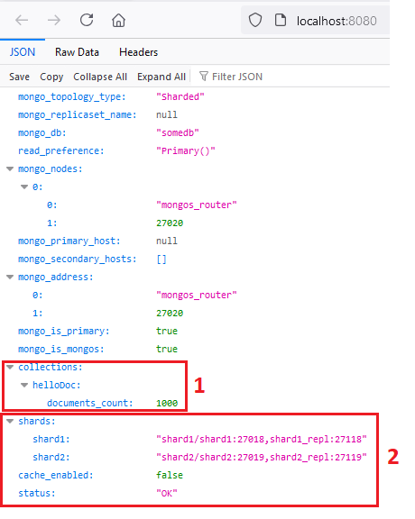
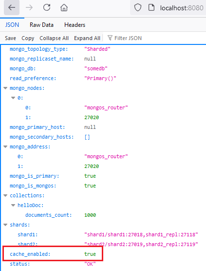

# Шардирование и репликация

## Задание 1. Планирование
Компонентные диаграммы для заданий 2, 3, ___ размещены в файле ```sprint_2_arch_template_task.drawio``` по адресу [https://drive.google.com/file/d/1YEmRRxcZH5r2NKpjdA4HfeUuWezjLG8Q/view?usp=sharing](https://drive.google.com/file/d/1YEmRRxcZH5r2NKpjdA4HfeUuWezjLG8Q/view?usp=sharing). Для наглядности все диаграммы размещены на одном листе и каждая диаграмм имеет свою подпись.


## Задание 2. Шардирование
В папке ```mongo-sharding``` размещен проект, демонстрирующий настройку БД для MongoDB с 2-мя шардами.
Компонентная диаграмма **mongo-sharding (task2) configuration** приведена в файле ```sprint_2_arch_template_task.drawio``` 

### Как запустить

Запуск приложения, роутера, конфигурационной БД и 2-х шардов выполняется с помощью команды 
```shell
docker compose up -d
```

После того, как все 5 контейнеров будут запущены необходимо выполнить дополнительные настройки. Скрипты для выполнения настроке размещены в каталоге ```mongo-sharding/scripts```

1. Конфигурация сервера конфигурации
```
run-init-config.bat
```
2. Инициализация шардов
```
run-init-shard1.bat
run-init-shard2.bat
```
3. Инициализация роутера и наполнение БД тестовыми данными
```
run-init-router.bat
```

### Проверки
1. Открыть в браузере адрес ``` http://localhost:8080```. Количество документов в БД должно быть >= 1000
2. Количество шардов дожно быть 2


1. Количество документов в shard1 должно быть 492 (при условии что всего документов в БД 1000)
```
docker exec -it shard1 mongosh --port 27018

shard1 [direct: primary] test> use somedb
switched to db somedb
shard1 [direct: primary] somedb> db.helloDoc.countDocuments()
492
```
4. Количество документов в shard2 должно быть 508 (при условии что всего документов в БД 1000)
```
docker exec -it shard2 mongosh --port 27019

shard2 [direct: primary] test> use somedb
switched to db somedb
shard2 [direct: primary] somedb> db.helloDoc.countDocuments()
508
```

## Задание 3. Репликация
В папке ```mongo-sharding-repl``` размещен проект, демонстрирующий настройку БД для MongoDB с 2-мя шардами, каждый из которых в свою очередь сконфигурирован для работы с 2-мя репликами.
Компонентная диаграмма **mongo-sharding-repl (task3) configuration** приведена в файле ```sprint_2_arch_template_task.drawio``` 

### Как запустить
Шаги по запуску и настройке после запуска полностью аналогичны шагам, описанным в Задании 2.

### Проверки
1. Открыть в браузере адрес ``` http://localhost:8080```. Количество документов в БД должно быть >= 1000
2. Количество шардов дожно быть 2, каждый шард должен иметь 2 узла


1. Количество документов в shard1 должно быть 492 (при условии что всего документов в БД 1000)
```
docker exec -it shard1 mongosh --port 27018

shard1 [direct: primary] test> use somedb
switched to db somedb
shard1 [direct: primary] somedb> db.helloDoc.countDocuments()
492
```
4. Количество документов в shard1_repl должно быть 492 (при условии что всего документов в БД 1000)
```
docker exec -it shard1 mongosh --port 27018

shard1 [direct: secondary] test> use somedb
switched to db somedb
shard1 [direct: secondary] somedb> db.helloDoc.countDocuments()
492
```
5. Количество документов в shard2 должно быть 508 (при условии что всего документов в БД 1000)
```
docker exec -it shard2 mongosh --port 27019

shard2 [direct: primary] test> use somedb
switched to db somedb
shard2 [direct: primary] somedb> db.helloDoc.countDocuments()
508
```
6. Количество документов в shard2_repl должно быть 508 (при условии что всего документов в БД 1000)
```
docker exec -it shard2_repl mongosh --port 27119

shard2 [direct: secondary] test> use somedb
switched to db somedb
shard2 [direct: secondary] somedb> db.helloDoc.countDocuments()
508
```

### Задание 4. Кэширование
В папке ```sharding-repl-cache``` размещен проект, демонстрирующий настройку БД для MongoDB с 2-мя шардами, каждый из которых в свою очередь сконфигурирован для работы с 2-мя репликами и включенным кэшированием.
Компонентная диаграмма **sharding-repl-cache (task4) configuration** приведена в файле ```sprint_2_arch_template_task.drawio``` 

Конфигурация проекта с кэшированием в целом аналогична конфигурации проекта из задания 3. Основное изменение - добавлен 1 инстанс redis для организации кэша. В виду ограниченных вычислительных ресурсов, принято решение не использовать кластер redis.

### Проверки
Проверки аналогичные проверкам для задания 3. Дополнительно, работу с кэшем можно проверить следующим образом:
1. cache_enabled: true в информации о приложении

2. Выполнив следующие команды 
```
docker exec -it redis redis-cli KEYS *
curl -o NUL -s -w "Total: %{time_total}s\n" http://localhost:8080/helloDoc/users
```


## Задание 5
Компонентная диаграмма **horizontal scaling (task5) configuration** приведена в файле ```sprint_2_arch_template_task.drawio``` 
Конфигурация проекта модифицирована в части горизонтального масштабирования с использованием компонентом APISIX Gateway и Consul

## Задание 6
Компонентная диаграмма **horizontal scaling + CDN (task6) configuration** приведена в файле ```sprint_2_arch_template_task.drawio``` 
Конфигурация проекта дополненна компонентом CDN